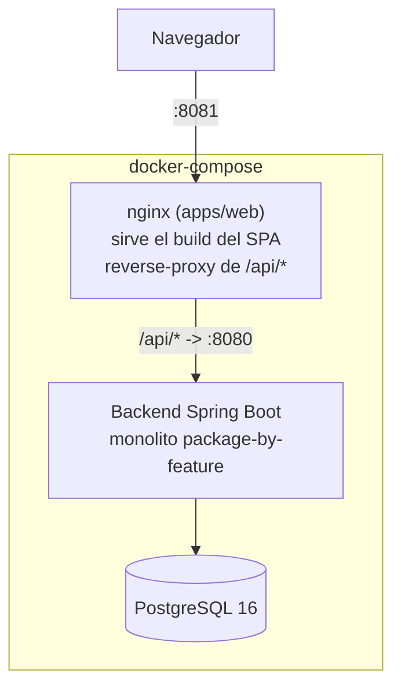

# FleetMgm

Sistema de gestión de flotas. Backend: Java 21 + Spring Boot 3.5. Frontend: React + Vite + TypeScript (monorepo, con lógica compartida preparada para una futura app móvil). Las decisiones de arquitectura y su justificación viven en [`planning.md`](planning.md).

## Por qué surge FleetMgm

Antes de convertirse en un TFM, este proyecto surge como respuesta a un problema real que viví de cerca. Trabajé como administrativo en una PYME del sector de transporte y logística, y desde dentro pude ver cómo se gestionaba el día a día de la flota: facturacion en formularios de Access guardados en un NAS, GPS en múltiples apps, trabajos anotados en papel, mantenimientos en hojas de excel, al igual que las mercancías que llevan los camiones. Ninguna se integraba ni intercambiaba datos automáticamente con las demás. Todo ello anotado a mano, disperso, y solo accesible desde el ordenador de la oficina.

FleetMgm nace como la respuesta que a mí me habría gustado tener entonces: una única plataforma que centraliza vehículos, personal, trabajos, mantenimiento, facturación y GPS, pensada para pymes que no necesitan (ni pueden permitirse) un ERP corporativo, y accesible desde cualquier lugar — no solo desde la oficina. (App mobile en proceso)

## Demo en vivo

- **Frontend**: https://fleet-mgm-web.vercel.app
- **Backend**: https://fleetmgm-production.up.railway.app (`/actuator/health` para confirmar que está activo)

Credenciales de acceso: ver la tabla en [Credenciales demo](#credenciales-demo) más abajo — son las mismas tanto en este despliegue como en el demo local con `docker compose`.

## Requisitos previos

Solo hacen falta para correr el proyecto en local — la demo en vivo de arriba no requiere nada instalado.

| Herramienta | Versión | Para qué |
|---|---|---|
| Docker Desktop | reciente | [Arranque rápido](#arranque-rápido-demo-local) y [Desarrollo local con Docker](#desarrollo-local-con-docker) |
| Java | 21 | [Backend sin Docker](#backend) — el Maven Wrapper (`./mvnw`) ya está incluido, no hace falta instalar Maven |
| Node | 22 (ver [`.nvmrc`](.nvmrc)) | [Frontend sin Docker](#frontend) |
| PostgreSQL | 16 | Solo si corrés el backend sin Docker (ver cómo levantarlo con `docker run` más abajo) |

## Stack tecnológico

| Capa | Tecnología |
|---|---|
| Backend | Java 21, Spring Boot 3.5, Spring Security (JWT), Spring Data JPA, Flyway |
| Base de datos | PostgreSQL 16 |
| Frontend | React 19, Vite, TypeScript, TanStack Query, Zustand, Tailwind CSS + shadcn/ui |
| Monorepo | Turborepo + npm workspaces |
| Rate limiting | Bucket4j |
| Logging | Logstash Logback Encoder (JSON estructurado) |
| Métricas | Micrometer + Prometheus |
| CI/CD | GitHub Actions (tests, OWASP Dependency-Check, escaneo de seguridad semanal) |


## Arquitectura



El backend es un **monolito organizado por feature (package-by-feature)** — cada dominio (`auth`, `vehicle`, `worker`, `client`, `job`, `billing`, `workshop`, `gps`, `supplier`, `dashboard`) tiene sus propios sub-paquetes `api/` (controllers), `application/` (servicios), `domain/` (entidades), `infrastructure/` (repositorios) y `dto/`. Las responsabilidades transversales (`GlobalExceptionHandler`, `AuditLog`, `CorrelationIdFilter`, `RateLimitFilter`, `PageResponse<T>`) viven en `shared/`. Los módulos se comunican mediante Spring Application Events, no con llamadas directas — así, por ejemplo, completar un trabajo puede actualizar el kilometraje del vehículo y generar una línea de factura sin que `JobService` sepa que esos otros módulos existen.

El detalle completo — modelo de dominio, matriz de permisos, esquema de base de datos, modelo de seguridad, y el razonamiento detrás de cada hito — está en [`planning.md`](planning.md).

## Funcionalidades

- Autenticación JWT (access token 15 min / refresh token 7 días) con bloqueo de cuenta, rate limiting y auditoría estructurada
- RBAC de 5 roles (`ADMIN > MANAGER > ADMINISTRATIVE > WORKSHOP_STAFF > DRIVER`)
- Gestión de flota de vehículos (ligeros, pesados, maquinaria pesada) con historial de asignación de conductores
- Ciclo de vida de trabajos (crear → iniciar → completar) con actualización automática de uso y generación de facturas
- Agenda e historial de mantenimiento de taller (preventivo/correctivo)
- Facturación a clientes y proveedores, con exportación a PDF
- Reporte de rentabilidad por vehículo y dashboard financiero de toda la flota
- Mapa GPS de flota en vivo (posiciones simuladas, renderizado real con Leaflet)
- Visor completo de auditoría con filtros

## Arranque rápido (demo local)

Requiere Docker Desktop.

```bash
docker compose up -d --build
```

Esto construye y levanta tres contenedores — `postgres`, `backend` y `web` (nginx sirviendo el build del frontend) — conectados entre sí con healthchecks. Flyway aplica el esquema y siembra datos demo realistas automáticamente (28 vehículos, 10 clientes, 20 proveedores, ~100 trabajos, facturas repartidas entre enero y julio de 2026).

Cuando `docker compose ps` muestre los tres como `healthy`, abrí **http://localhost:8081**.

### Credenciales demo

Todas las cuentas usan la contraseña `Demo1234!`.

| Rol | Email |
|---|---|
| ADMIN | `admin@fleetmgm.demo` |
| MANAGER | `gerente@fleetmgm.demo` |
| ADMINISTRATIVE | `administrativo1@fleetmgm.demo`, `administrativo2@fleetmgm.demo` |
| WORKSHOP_STAFF | `taller1@fleetmgm.demo`, `taller2@fleetmgm.demo`, `taller3@fleetmgm.demo` |
| DRIVER | `conductor1@fleetmgm.demo`, `conductor2@fleetmgm.demo`, `conductor3@fleetmgm.demo` |

Para reiniciar los datos demo a su estado original:

```bash
docker compose down -v && docker compose up -d --build
```

## Desarrollo local (sin Docker)

Útil cuando se está desarrollando activamente en vez de solo correr la demo — ciclo de feedback más rápido, sin reconstruir imágenes.

### Backend

```bash
cd backend
./mvnw spring-boot:run          # http://localhost:8080, necesita un Postgres local (ver abajo)
./mvnw test                     # tests unitarios
./mvnw verify -Pfailsafe        # + tests de integración (Testcontainers — requiere Docker)
```

Necesita una instancia de Postgres accesible en `jdbc:postgresql://localhost:5432/fleetmgm` (usuario/contraseña `fleetmgm`), o se puede sobreescribir vía `SPRING_DATASOURCE_URL`/`_USERNAME`/`_PASSWORD`. `docker run -d -e POSTGRES_DB=fleetmgm -e POSTGRES_USER=fleetmgm -e POSTGRES_PASSWORD=fleetmgm -p 5432:5432 postgres:16` es la forma más rápida de tener una.

Documentación interactiva de la API (Swagger UI) corriendo así: **http://localhost:8080/swagger-ui.html** — solo disponible sin el perfil `prod` (el que usa `docker compose`, donde queda deshabilitada).

### Frontend

Requiere Node 22 (ver [`.nvmrc`](.nvmrc); con `nvm` alcanza con `nvm use`).

```bash
npm install                     # desde la raíz del repo — instala todos los workspaces
turbo dev                       # arranca todas las apps en modo dev (web en :5173)
turbo test                      # Vitest en todos los workspaces (packages/ + apps/web)
turbo lint                      # oxlint en todos los workspaces
```

El servidor de desarrollo mockea la API con MSW (`VITE_ENABLE_MSW=true` en `apps/web/.env.local`) — no hace falta un backend corriendo para trabajar solo en el frontend.

### API key de NVD (OWASP Dependency-Check)

`backend/pom.xml` corre `org.owasp:dependency-check-maven`, que descarga datos de CVEs desde el NVD. Sin una API key, el NVD limita mucho la velocidad de descarga y la primera vez puede tardar muchísimo.

1. Pide una key gratuita: https://nvd.nist.gov/developers/request-an-api-key
2. Guardala en `.env` en la raíz del repo (ya está en `.gitignore`):
   ```
   NVD_API_KEY=tu-key
   ```
3. En cada sesión nueva de PowerShell, cargala en el entorno **antes** de correr Maven (la variable no persiste entre reinicios de terminal):
   ```powershell
   cd backend
   $env:NVD_API_KEY = (Get-Content ..\.env | Select-String '^NVD_API_KEY=(.*)').Matches.Groups[1].Value
   ```
4. Verifica que cargó bien (debería imprimir tu key, no quedar en blanco):
   ```powershell
   $env:NVD_API_KEY
   ```
5. Corre el chequeo:
   ```powershell
   .\mvnw.cmd dependency-check:check
   ```

El CI lee la misma variable desde el secret `NVD_API_KEY` de GitHub Actions (ya configurado) — ahí no hace falta ningún `.env`.

## Desarrollo local con Docker

A diferencia del [arranque rápido](#arranque-rápido-demo-local) — pensado para correr la demo una sola vez —, esta opción sirve para seguir iterando sobre el código sin instalar Java ni Node en la máquina: se reconstruye solo el servicio que cambió en vez de los tres contenedores.

```bash
docker compose up -d --build backend   # después de un cambio en backend/
docker compose up -d --build web       # después de un cambio en apps/web/
docker compose logs -f backend         # ver logs en vivo de un servicio
```

Esto sigue reconstruyendo la imagen completa en cada cambio (el `docker-compose.yml` actual no monta el código fuente como volumen ni usa un dev server con hot-reload) — para un ciclo de feedback más rápido, usar la sección [Desarrollo local (sin Docker)](#desarrollo-local-sin-docker) de arriba.

## Despliegue a producción

Configuración recomendada de costo cero: **frontend → Vercel**, **backend + base de datos → Railway**.

Variables de entorno requeridas para el backend:

```
SPRING_DATASOURCE_URL       # connection string del Postgres provisto por Railway
JWT_SECRET                  # mínimo 64 caracteres — nunca reutilizar el default de dev
SPRING_PROFILES_ACTIVE=prod,demo   # `demo` es opcional — solo agregarlo para sembrar también los datos demo
FRONTEND_URL                # ej. https://fleetmgm.vercel.app — usado para CORS
```

El perfil `prod` desactiva Swagger UI y el logging verboso de SQL, y activa `server.forward-headers-strategy=framework` para que el header HSTS se emita correctamente detrás del proxy TLS de Railway. Ver las notas del Hito 46 en `planning.md` para el razonamiento detrás de cada una de estas decisiones.

Demo local expuesta con una URL pública temporal (no es un despliegue real):

```bash
docker compose up -d --build
ngrok http 8081
```

## Valoración personal y conclusiones

He decidido hacer uso del framework de Spring boot porque trabajo hace varios años con spring MVC y entornos JAVA, esto me da seguridad y control sobre el codigo que me generan los agentes al entender que se debería hacer y que no, con lo cual eso me ha servido para ver donde la IA empezaba a alucinar, sugerir cosas que no corresponden con lo necesario etc..

El stack de REACT viene decidido por la posibilidad de reutilizar codigo entre el frontEnd web y la APP Mobile, sin embargo no disponia de conocimientos de REACT, pero me ha servido para salir de mi zona de confort, por ello que me ha sido más complicado controlar el código generado y en ciertas ocasiones he tenido que iterar con la IA para entender que pretendía hacer.

A modo de conclusión, aunque se que el proyecto no me resuelve una problemática personal, me ha servido para conocer las capacidades de la IA, tanto en generación de código como en análisis del código generado y detección de BUGs antes de que el código llegue a la rama Main. 

## Autor

Marcos Cuevas Alonso — Trabajo Fin de Máster.

## Licencia

Todos los derechos reservados — ver [`LICENSE`](LICENSE).
