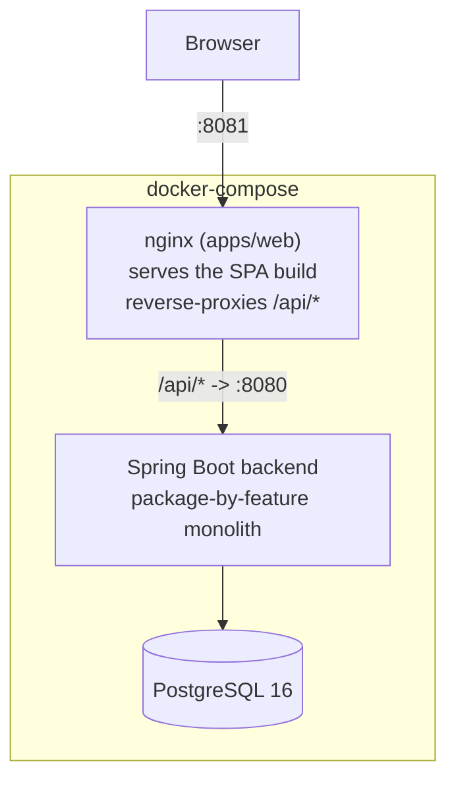

# FleetMgm

Fleet management system built as a Master's thesis project. Backend: Java 21 + Spring Boot 3.5. Frontend: React + Vite + TypeScript (monorepo, shared logic prepared for a future mobile app). Architectural decisions and their rationale live in [`planning.md`](planning.md).

## Tech stack

| Layer | Technology |
|---|---|
| Backend | Java 21, Spring Boot 3.5, Spring Security (JWT), Spring Data JPA, Flyway |
| Database | PostgreSQL 16 |
| Frontend | React 19, Vite, TypeScript, TanStack Query, Zustand, Tailwind CSS + shadcn/ui |
| Monorepo | Turborepo + npm workspaces |
| Rate limiting | Bucket4j |
| Logging | Logstash Logback Encoder (structured JSON) |
| Metrics | Micrometer + Prometheus |
| CI/CD | GitHub Actions (tests, OWASP Dependency-Check, weekly security scan) |

## Architecture



The backend is a **package-by-feature monolith** — each domain (`auth`, `vehicle`, `worker`, `client`, `job`, `billing`, `workshop`, `gps`, `supplier`, `dashboard`) owns its own `api/` (controllers), `application/` (services), `domain/` (entities), `infrastructure/` (repositories), and `dto/` sub-packages. Cross-cutting concerns (`GlobalExceptionHandler`, `AuditLog`, `CorrelationIdFilter`, `RateLimitFilter`, `PageResponse<T>`) live in `shared/`. Modules communicate via Spring Application Events, not direct calls, so e.g. completing a job can update vehicle mileage and generate an invoice line without `JobService` knowing either of those modules exists.

Full details — domain model, permission matrix, database schema, security model, and the reasoning behind every milestone — are in [`planning.md`](planning.md).

## Features

- JWT authentication (15 min access / 7 day refresh) with account lockout, rate limiting, and structured audit logging
- 5-role RBAC (`ADMIN > MANAGER > ADMINISTRATIVE > WORKSHOP_STAFF > DRIVER`)
- Vehicle fleet management (light vehicles, heavy vehicles, heavy machinery) with driver assignment history
- Job lifecycle (create → start → complete) with automatic usage tracking and invoice generation
- Workshop maintenance scheduling and history (preventive/corrective)
- Client and supplier invoicing, with PDF export
- Per-vehicle profitability reporting and a fleet-wide financial dashboard
- Live GPS fleet map (mocked positions, real map rendering via Leaflet)
- Full audit trail viewer with filtering

## Screenshots

*(Add screenshots here — log in to the running demo at `http://localhost:8081` with the credentials below and capture: Dashboard, Vehicles list, Vehicle profitability panel, Job lifecycle, GPS map, Audit log viewer.)*

## Quick start (local demo)

Requires Docker Desktop.

```bash
docker compose up -d --build
```

This builds and starts three containers — `postgres`, `backend`, and `web` (nginx serving the frontend build) — wired together with healthchecks. Flyway applies the schema and seeds realistic demo data (28 vehicles, 10 clients, 20 suppliers, ~100 jobs, invoices spanning January–July 2026) automatically.

Once `docker compose ps` shows all three as `healthy`, open **http://localhost:8081**.

### Demo credentials

All accounts use the password `Demo1234!`.

| Role | Email |
|---|---|
| ADMIN | `admin@fleetmgm.demo` |
| MANAGER | `gerente@fleetmgm.demo` |
| ADMINISTRATIVE | `administrativo1@fleetmgm.demo`, `administrativo2@fleetmgm.demo` |
| WORKSHOP_STAFF | `taller1@fleetmgm.demo`, `taller2@fleetmgm.demo`, `taller3@fleetmgm.demo` |
| DRIVER | `conductor1@fleetmgm.demo`, `conductor2@fleetmgm.demo`, `conductor3@fleetmgm.demo` |

To reset the demo data to its original seeded state:

```bash
docker compose down -v && docker compose up -d --build
```

## Local development (without Docker)

Useful when actively developing rather than just running the demo — faster feedback loop, no image rebuilds.

### Backend

```bash
cd backend
./mvnw spring-boot:run          # http://localhost:8080, needs a local Postgres (see below)
./mvnw test                     # unit tests
./mvnw verify -Pfailsafe        # + integration tests (Testcontainers — requires Docker)
```

Needs a Postgres instance reachable at `jdbc:postgresql://localhost:5432/fleetmgm` (user/password `fleetmgm`), or override via `SPRING_DATASOURCE_URL`/`_USERNAME`/`_PASSWORD`. `docker run -d -e POSTGRES_DB=fleetmgm -e POSTGRES_USER=fleetmgm -e POSTGRES_PASSWORD=fleetmgm -p 5432:5432 postgres:16` is the fastest way to get one.

### Frontend

```bash
npm install                     # from the repo root — installs all workspaces
turbo dev                       # starts every app in dev mode (web on :5173)
```

The dev server mocks the API via MSW (`VITE_ENABLE_MSW=true` in `apps/web/.env.local`) — no running backend required for frontend-only work.

### NVD API key (OWASP Dependency-Check)

`backend/pom.xml` runs `org.owasp:dependency-check-maven`, which downloads CVE data from NVD. Without an API key, NVD rate-limits requests heavily and the first download can take a very long time.

1. Request a free key: https://nvd.nist.gov/developers/request-an-api-key
2. Store it in `.env` at the repo root (already gitignored):
   ```
   NVD_API_KEY=your-key-here
   ```
3. Every new PowerShell session, load it into the environment **before** running Maven (the variable does not persist across terminal restarts):
   ```powershell
   cd backend
   $env:NVD_API_KEY = (Get-Content ..\.env | Select-String '^NVD_API_KEY=(.*)').Matches.Groups[1].Value
   ```
4. Verify it loaded (should print your key, not blank):
   ```powershell
   $env:NVD_API_KEY
   ```
5. Run the check:
   ```powershell
   .\mvnw.cmd dependency-check:check
   ```

CI reads the same variable from the `NVD_API_KEY` GitHub Actions secret (already configured) — no `.env` needed there.

## Production deployment

Zero-cost recommended setup: **frontend → Vercel**, **backend + database → Railway**.

Required backend environment variables:

```
SPRING_DATASOURCE_URL       # Railway-provisioned Postgres connection string
JWT_SECRET                  # min 64 chars — never reuse the dev default
SPRING_PROFILES_ACTIVE=prod,demo   # `demo` is optional — only add it to also seed demo data
FRONTEND_URL                # e.g. https://fleetmgm.vercel.app — used for CORS
```

The `prod` profile disables Swagger UI and verbose SQL logging, and enables `server.forward-headers-strategy=framework` so HSTS is correctly emitted behind Railway's TLS-terminating edge. See `planning.md`'s Hito 46 notes for the reasoning behind each of these.

Local demo over a temporary public URL (no real deployment):

```bash
docker compose up -d --build
ngrok http 8081
```
